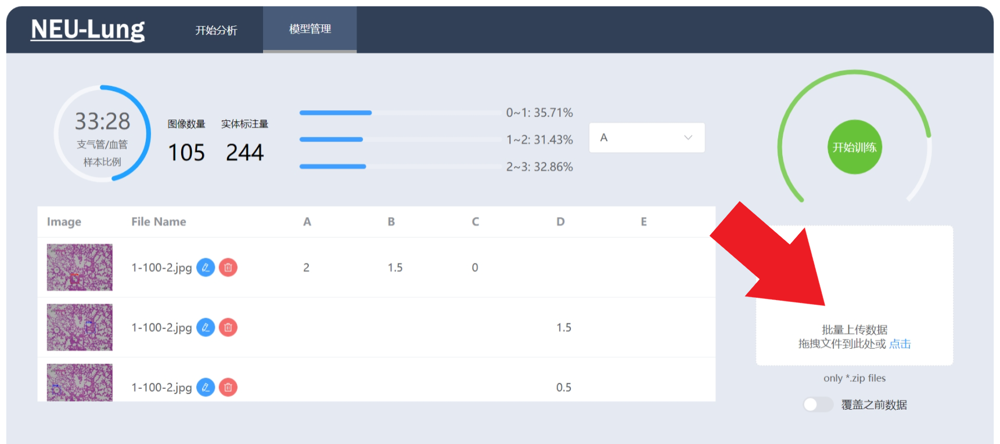

# NEU Lung

## 简介

小鼠肺部图片肺炎诊断

## 前端应用

[neu-lung2022-font](https://github.com/YoungY620/neu-lung2022-front)

## 尝试运行

1. 下载源码并安装依赖

   ```powershell
   # in powershell
   git clone https://github.com/YoungY620/neu-lung2022
   cd neu-lung2022
   pip install virtualenv
   virtualenv venv -p python3.8    # 重要: 指定Python版本为3.8
   ./venv/Scripts/Activate.ps1
   pip install -r requirements.txt -i https://pypi.tuna.tsinghua.edu.cn/simple
   ```

2. 使用 `annotation_db_setup.sql` 初始化数据表

3. 下载模型, 并解压到 `./lung/core/models`

   ```powershell
   # in powershell
   Invoke-WebRequest https://github.com/YoungY620/neu-lung2022/releases/download/v0.4/models.zip -outfile models.zip
   Expand-Archive -path models.zip -DestinationPath ./lung/core/models
   ```

   完成后目录结构：

   ```powershell
   PS D:\your-base-path\neu-lung2022> dir ./lung/core/models

    Directory: D:\your-base-path\neu-lung2022\lung\core\models

   Mode                 LastWriteTime         Length Name
   ----                 -------------         ------ ----
   -a----         20xx/x/xx     xx:xx         184448 background.npy
   -a----         20xx/x/xx     xx:xx         184448 cytoplasm.npy
   -a----         20xx/x/xx     xx:xx       14396405 detector_yolov5.pt
   -a----         20xx/x/xx     xx:xx         184448 nucleus.npy
   -a----         20xx/x/xx     xx:xx      137785213 simclr_encoder.pth.tar
   -a----         20xx/x/xx     xx:xx        1464705 vot_reg_a.pk
   -a----         20xx/x/xx     xx:xx        1844092 vot_reg_b.pk
   -a----         20xx/x/xx     xx:xx        1799945 vot_reg_c.pk
   -a----         20xx/x/xx     xx:xx        2065245 vot_reg_d.pk
   -a----         20xx/x/xx     xx:xx        1794861 vot_reg_e.pk
   ```

4. 运行服务

   ```powershell
   # in powershell
   ./run.ps1
   ```

   之后, 按照[说明](https://github.com/YoungY620/neu-lung2022-front/blob/master/README.md)运行前端

5. 下载数据 `data.zip`:

   ```powershell
   # in powershell
   Invoke-WebRequest https://github.com/YoungY620/neu-lung2022/releases/download/v0.4/data.zip -outfile data.zip
   ```

   在前端 "批量上传数据" 处选择上传该 `data.zip` 文件作为初始数据

   

## 参考

基于以下项目二次开发：

- [YOLOv5](https://github.com/ultralytics/yolov5)
- [SimCLR(Pytorch)](https://github.com/sthalles/SimCLR)
- 目标检测可视化前后端设计参考: [Yolov5-Flask-VUE](https://github.com/Sharpiless/Yolov5-Flask-VUE/blob/master/back-end/app.py)
